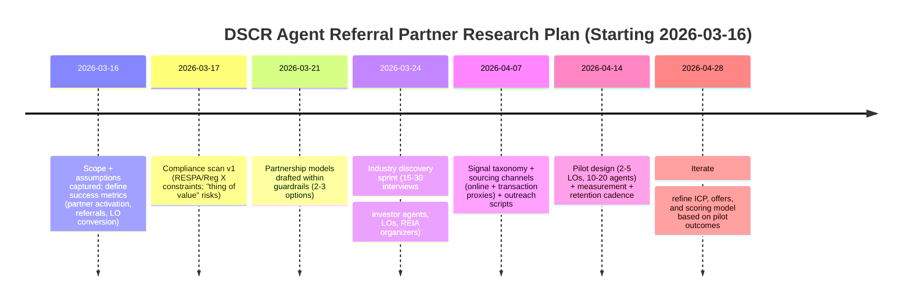

# Deep Research Blueprint for a DSCR Agent Referral Partner Channel

## Executive summary

The attached prompt is a *go-to-market + compliance + data* research request: you’re building a B2B platform that supplies scored/enriched investor leads (property owners likely to need DSCR financing) to mortgage loan officers, and you want to scale via real estate agents who specialize in investor buyers. fileciteturn0file0

Because this channel touches mortgage “settlement services,” the highest-leverage first step is to define **what partnership structures are legally/operationally feasible** (and which are not), then design an ICP + sourcing model that stays inside those boundaries. As a baseline, the “no referral fees / no kickbacks” rule under Regulation X is explicit, and mortgage-related MBAs/MSAs and “things of value” need careful structuring. citeturn0search0turn0search4turn0search8

Below are four plausible research directions—academic, industry, policy, and technical—each with research questions, source sets, search strategies, deliverables, effort, and clarifying questions. The recommended starting point is **Policy & compliance**, because it constrains the feasible “LO–agent lead-sharing” mechanics and prevents building a growth motion that later becomes unusable. citeturn0search0turn0search4turn1search12

## Assumptions and scope boundaries

Assumptions (explicit, because core constraints were not provided):

- The attached prompt you want researched is the DSCR referral partner channel prompt in the uploaded file, including: investor-focused agent operations, identification signals, REIA ecosystem mapping, LO–agent–investor partnership models, compliance constraints, outreach/retention playbooks, and market-by-market ICP development. fileciteturn0file0  
- “DSCR” is treated both as (a) the underwriting metric **debt service coverage ratio**, commonly used to assess whether cash flow covers debt service, and (b) the investor mortgage product commonly marketed as “DSCR / investor cash-flow loan,” which some lenders describe as a non-QM loan that can qualify borrowers without relying on personal income. citeturn0search1turn0search16  
- No constraints were provided on: target states/metros beyond those listed in the prompt, budget, timeline, whether you can purchase MLS/recorder datasets, whether you have a compliance attorney, whether you want to avoid paid REIA sponsorships, or how “lead sharing” is intended to work operationally.  
- No user-preferred sources were specified (e.g., “only paywalled industry research,” “only government sources,” “only academic papers”). Default approach here prioritizes primary/official sources (regulators, trade org definitions, first-party program pages) and then high-quality industry datasets for market sizing (e.g., large property data vendors).

## Four research directions for this prompt

The prompt contains many sub-questions; these directions are four *ways to organize* the research so outputs are decision-ready.

### Academic perspective: behavior, incentives, and network formation in investor-heavy transactions

**Core aim**  
Explain *why* and *when* investment-focused agents adopt (or resist) new lender relationships, using incentive alignment, trust formation, and network-diffusion frameworks.

**Research questions**  
- What are the dominant drivers of durable referral relationships in professional services networks (trust, reputation, reciprocity, repeated interaction, specialization signaling)?  
- How do “repeat/portfolio” clients change an agent’s economics versus one-time buyers, and how might that affect willingness to adopt a new lender relationship?  
- What behavior patterns differentiate “investor agents” from generalists (deal speed, deal flow sources, risk tolerance, financing sophistication)?

**Key sources to consult (priority order)**  
- Peer-reviewed literature on professional referral networks, repeated-game cooperation, principal-agent incentives, and inter-firm partnering (business/marketing/organizational behavior journals).  
- Empirical housing/real estate finance research that distinguishes investor vs owner-occupant behavior (economic and housing journals).  
- Industry surveys used as behavioral baselines (e.g., NAR buyer/seller research as a proxy for influence channels, not as direct evidence of agent specialization). citeturn1search3turn1search11

**Search strategies and keywords**  
- Keywords: “referral network formation professional services,” “partner channel incentives real estate agents lenders,” “repeat transaction value real estate agent investor clients,” “trust reciprocity repeated interactions B2B referrals,” “two-sided marketplace real estate leads.”  
- Strategy: start broad (theory + meta-analyses), then narrow to real-estate-adjacent contexts; extract practical hypotheses to test in interviews/experiments.

**Expected deliverables**  
- Conceptual model: *Agent ↔ Investor ↔ Loan Officer* incentive map (what each wants, what they fear, what creates “stickiness”).  
- Interview guide grounded in theory: questions designed to reveal adoption barriers and trust triggers.  
- Hypothesis list for testing (e.g., “agents convert faster when LO offers underwriting speed + investor education + consistent lead reciprocity”).

**Estimated time and effort**  
- 1–2 weeks for an annotated literature synthesis + hypothesis framework (single researcher), plus optional ongoing iteration as field data arrives.

**Clarifying questions most relevant to this direction**  
- Are you optimizing for *short-term referrals* or *long-term partner retention and exclusivity*?  
- Do you expect agents to be your primary acquisition channel, or one of several co-equal channels?

### Industry perspective: ICP sizing, sourcing playbooks, and partnership model benchmarking

**Core aim**  
Build a field-validated “how the channel works” playbook: who the investor agents are, how they source clients, how they choose lenders, what partnership offers resonate, and how you find them at scale.

**Research questions**  
- What is a defensible segmentation of “investor-focused agents” (fix-and-flip focused, long-term rental focused, STR focused, small multifamily focused, etc.)?  
- What signals reliably indicate investor focus (transaction patterns, LLC buyers, repeat investor clients, investor-heavy ZIPs, cash-heavy patterns) and which are noise?  
- What outreach channels produce meetings and referrals (events, LinkedIn, email, brokerage trainings, investor communities)?  
- What do successful LO–agent partnerships “trade” in practice (speed, certainty, education, deal structuring, lead reciprocity), and what operational rhythms sustain them?

**Key sources to consult (priority order)**  
- Trade organization definitions of credentials and specializations to understand what designations *claim* to cover (then validate with data). For example, NAR’s listing includes certifications like “Real Estate Investing (REI),” plus niche certifications such as “Resort & Second Home Property Specialist (RSPS)” and “Short Sales & Foreclosure Resource (SFR®),” which may or may not correlate with active investor transaction work. citeturn3view0turn2view0  
- Investor community platforms and directories as *lead sources* (to be validated for quality), including entity["company","BiggerPockets","real estate investing platform"].  
- High-quality market data providers for “investor share” baselines, because investor presence varies sharply by region and period. For example, entity["company","Redfin","real estate brokerage data"] reports investor share estimates (with its own definitions), and entity["company","ATTOM","property data company"] reports institutional investor shares in annual home sales reporting—these are useful baselines but must be reconciled because “investor” definitions differ. citeturn1search5turn1search6turn1search2  
- REIA ecosystem sources (national and local) for event-based distribution mechanics; entity["organization","National REIA","us investor association"] publicly states it has “over 120” local chapters/associations and tens of thousands of members, which can guide prioritization of event targeting. citeturn0search3turn0search7

**Search strategies and keywords**  
- Keywords: “investor friendly agent” + metro, “real estate investing agent referral program lender,” “REIA sponsorship vendor table pricing,” “real estate agent investor niche brokerage program,” “DSCR loan officer realtor partnership.”  
- Strategy: benchmark *existing* lender/LO partner programs and co-marketing structures, then map to your product’s unique value (scored investor leads + financing intelligence).

**Expected deliverables**  
- ICP definition document: segmentation + “must-have signals” + disqualifiers.  
- Sourcing channel map: where to find each segment (events, communities, brokerage programs, online signals).  
- Partnership model library: 3–5 compliant models with scripts, onboarding steps, and “day 0–day 30–day 90” retention rhythms.  
- KPI set: meetings booked, partners activated, referrals per partner per month, LO reciprocation rate, time-to-first-referral.

**Estimated time and effort**  
- 2–4 weeks for a solid “v1 playbook” if you can run ~15–30 stakeholder interviews (agents + LOs), plus desk research; longer if you also collect/clean transaction data.

**Clarifying questions most relevant to this direction**  
- Which buyer-investor categories matter most (single-family rental, small multifamily, STR, flips)?  
- Do you want an “exclusive partner per ZIP/metro” model or a broader open partner model?  
- Can you pay for data (MLS/transaction/recorder datasets) to validate signals, or must this rely on public signals first?

### Policy perspective: compliance guardrails for LO–agent partnerships and lead sharing

**Core aim**  
Define what you *can safely do* (and how to document it), so the channel doesn’t depend on prohibited referral compensation.

**Why this direction is gating**  
Regulation X includes a clear “no referral fees” prohibition for settlement service business involving federally related mortgage loans. citeturn0search0  
The entity["organization","Consumer Financial Protection Bureau","us financial regulator"] also summarizes that RESPA Section 8(a) prohibits giving or accepting kickbacks/“things of value” for referrals involving federally related mortgage loans. citeturn0search4  
entity["organization","National Association of REALTORS®","real estate trade group"] similarly highlights that Section 8 generally prohibits giving/receiving a “thing of value” in exchange for referrals of settlement service business, and frames this as a frequent concern for agent relationships with settlement service providers. citeturn0search8  

**Research questions**  
- What partnership “value exchanges” are allowed vs restricted (e.g., education events, marketing services, data sharing, joint advertising, software access, lead sharing) under RESPA/Regulation X and any relevant state rules?  
- How should “co-marketing” and marketing services agreements be structured to avoid being viewed as disguised referral compensation?  
- What disclosures, documentation, “fair market value” substantiation, and operational controls are commonly used in compliant arrangements?

**Key sources to consult (priority order)**  
- Regulation X text for the prohibition language and definitions of referral fees/kickbacks. citeturn0search0  
- CFPB RESPA Section 8 FAQs and related CFPB guidance pages. citeturn0search4turn1search4  
- CFPB commentary about marketing services agreements and changes in guidance: CFPB has stated that rescinding earlier guidance does not mean MSAs are “per se or presumptively legal,” and legality depends on facts/circumstances. citeturn1search12  
- NAR’s practitioner-oriented RESPA overview (useful for how agents are taught to think about the risk). citeturn0search8

**Search strategies and keywords**  
- Keywords: “Regulation X 1024.14 referral fees interpretation,” “RESPA section 8 thing of value leads,” “mortgage co-marketing compliance,” “marketing services agreement fair market value documentation,” “loan officer real estate agent lead sharing RESPA.”  
- Strategy: extract hard constraints → derive a “menu” of permitted collaboration patterns → translate into partner offer design.

**Expected deliverables**  
- Compliance guardrails memo (plain-English): “Allowed / risky / prohibited” collaboration patterns as hypotheses.  
- 2–3 compliant partnership templates (concept-level): e.g., education partnership, data-driven analytics sharing, joint content marketing with documented FMV services (if applicable).  
- A checklist to review each experiment/pilot before launch (documentation, disclosures, no quid-pro-quo language, consistent pricing, audit trails).

**Estimated time and effort**  
- 3–7 days for an initial guardrails memo (desk research).  
- 1–2 additional weeks if you want a counsel-ready package: mapped workflows + draft contractual language outlines.

**Clarifying questions most relevant to this direction**  
- Are you considering **any** payments, discounts, free software access, exclusive leads, or “something of value” to agents or brokerages? If yes, what exactly?  
- Is your platform positioned as a marketing vendor, a data vendor, a marketplace, or a lead broker—and who pays whom in each flow?

### Technical perspective: building an “investor-agent signal engine” and experimentation system

**Core aim**  
Transform the prompt into a measurable data product: score *agents* for investor focus and score *investors/property owners* for DSCR propensity, then use experimentation to validate partner conversion and downstream loan outcomes.

**Research questions**  
- What data sources can reliably detect investor-heavy agent activity (transaction records, MLS data, deeds/LLC patterns, repeat buyer entities, non-owner occupancy proxies)?  
- What features predict DSCR relevance (rental cash-flow models, property type, rent estimates, ownership entity, equity, refinance propensity)?  
- How do you measure “quality” of an agent partner (referrals, conversion, cycle time, LO satisfaction, retention)?  
- How do you implement attribution without creating compliance risk or relying on “referral fee” constructs?

**Key sources to consult (priority order)**  
- Primary definitions and credential lists to seed feature hypotheses (e.g., NAR credential descriptions for “REI” and related niche certifications). citeturn3view0turn2view0  
- Market baselines to calibrate region-level priors (investor share varies; vendor definitions differ). citeturn1search5turn1search6  
- DSCR metric definitions from mainstream finance sources to standardize calculations (e.g., bank explainer material). citeturn0search1  
- DSCR loan product descriptions from lender first-party educational pages (useful for requirements/features, but not regulators). For example, a lender describes DSCR loans as “non-QM” and “investor cash flow” loans that can qualify without relying on personal income. citeturn0search16

**Search strategies and keywords**  
- Keywords: “LLC buyer repeat transactions feature engineering,” “non-owner-occupied proxy MLS,” “agent investor focus classification model,” “property owner refinance propensity model,” “DSCR underwriting rent estimate PTI DSCR threshold.”  
- Strategy: define label strategy first (what counts as investor agent?), then test multiple proxy labels to avoid overfitting to one dataset’s quirks.

**Expected deliverables**  
- Signal taxonomy + data dictionary for “investor agent” and “DSCR propensity.”  
- MVP scoring model spec (features, thresholds, evaluation).  
- Experiment plan: small pilots with a few LOs + agent partners to validate referral and conversion mechanics.

**Estimated time and effort**  
- 2–6 weeks depending on data access (public-only vs paid datasets) and whether you already have investor lead scoring infrastructure.

**Clarifying questions most relevant to this direction**  
- What data do you already have today (property ownership, contact enrichment, rent estimates, transaction history)?  
- Do you have access (directly or via partners) to MLS-level transaction data, or only public record / third-party property data?

## Prioritized path and risks

### Recommended direction to pursue first

**Start with Policy (compliance guardrails) as the gating workstream**, then immediately run an industry playbook sprint that stays within the guardrails.

Rationale: the prompt’s desired “lead-sharing” and reciprocal value exchange can unintentionally drift into “thing of value for referral” territory if not architected carefully. Regulation X’s “no referral fees” prohibition is explicit, and CFPB guidance emphasizes that legality of marketing/co-marketing structures depends on the details and circumstances. citeturn0search0turn0search4turn1search12

### Key risks to manage (and why they matter)

- **Compliance risk > channel risk**: the partnership might “work” economically but be non-viable if structured as quid-pro-quo referrals. citeturn0search0turn0search8  
- **Definition mismatch risk**: “investor share” metrics differ across data providers (e.g., “all investors” vs “institutional investors”), which can distort market sizing and mislead which metros are truly investor-dense. citeturn1search5turn1search6  
- **Credential noise risk**: designations/certifications can be helpful qualifiers but may reflect education rather than active investor deal flow; use them as weak signals until validated with transactions/outcomes. citeturn2view0turn3view0  
- **REIA channel variability**: national networks provide a discovery layer, but local meeting formats, sponsorship economics, and attendee mix vary widely; treat events as experiments rather than guaranteed acquisition. citeturn0search7turn0search11  

### Proposed research timeline (mermaid)



### Decision-point flowchart (mermaid)

```mermaid
flowchart TD
    A[Define the partnership offer] --> B{Does any party receive a "thing of value"\n tied to referring mortgage business?}
    B -->|Yes / unclear| C[Redesign offer to remove quid-pro-quo\nand add documentation controls]
    B -->|No| D[Proceed to ICP + sourcing design]
    C --> E{Can the value be reframed as legitimate,\nseparately priced services with supportable FMV\nand no referral conditioning?}
    E -->|No| F[Drop or replace the mechanism\n(e.g., focus on education/content + analytics sharing)]
    E -->|Yes| D
    D --> G{Do we have reliable agent-investor signals?}
    G -->|Public signals only| H[Build public-signal ICP + interview validation]
    G -->|Transaction/record data available| I[Build data-driven scoring + backtests]
    H --> J[Pilot outreach + measure activation + referrals]
    I --> J
    J --> K{Is partner retention and reciprocity strong?}
    K -->|No| L[Adjust offer, cadence, enablement; revisit ICP]
    K -->|Yes| M[Scale: templates, playbooks, expansion by metro]
```

## Direction comparison table

| Research direction | Relevance to decisions | Feasibility now | Time to useful output | Cost profile | Expected impact if done well |
|---|---|---|---|---|---|
| Policy (compliance guardrails) | Very high (gating) | High (desk research + counsel review) | Fast (days to 2 weeks) | Low–Medium | Very high (prevents dead-end GTM) |
| Industry (ICP + playbook benchmarking) | Very high | Medium–High (requires interviews) | Medium (2–4 weeks) | Low–Medium | High (drives conversion + retention) |
| Technical (signals + scoring + experiments) | High | Medium (depends on data access) | Medium–Slow (2–6 weeks) | Medium–High | High (scalable targeting + measurement) |
| Academic (behavior/incentives) | Medium | High | Medium (1–2 weeks for synthesis) | Low | Medium (improves messaging + hypotheses) |

## Clarifying questions and immediate next steps

### Short checklist of clarifying questions to proceed (no permission needed)

- What exact “value exchange” do you envision between loan officers and agents: shared leads, co-marketing, education events, analytics dashboards, software access, or something else?  
- Are you planning to pay agents or brokerages in any form (cash, gift cards, discounted services, free platform access, exclusive leads)? If yes, specify the mechanics.  
- Which investor segments are top priority (long-term rentals, flips, STR, small multifamily), and which DSCR scenarios matter most (purchase vs refinance vs cash-out)?  
- What data assets do you already possess (ownership, LLC normalization, rent estimates, transaction history), and what datasets can you buy or license?  
- What is the success definition for the agent channel in the first 90 days (meetings, signed partners, referrals, funded loans, CAC)?  
- Which metros/states are priority to launch first (top 3), and why?

### Next steps (actionable, ordered)

1. Draft a one-page “partner offer” and run it through a compliance guardrail screen anchored on Regulation X’s referral-fee prohibition and CFPB RESPA FAQs. citeturn0search0turn0search4  
2. Convert the prompt into an interview sprint: 10 investor-focused agents, 10 DSCR-active LOs, 3 REIA organizers; use the findings to validate which “signals” predict real investor specialization.  
3. Build a v1 signal taxonomy using a small set of high-signal indicators (repeat LLC buyers, investor-niche content, REI-related credentials as weak signals) and test it against observed deal flow. citeturn3view0turn2view0  
4. Stand up a pilot with explicit measurement and retention cadence; use investor baseline variability (e.g., vendor-reported investor shares) only as priors, not as ground truth for targeting. citeturn1search5turn1search6