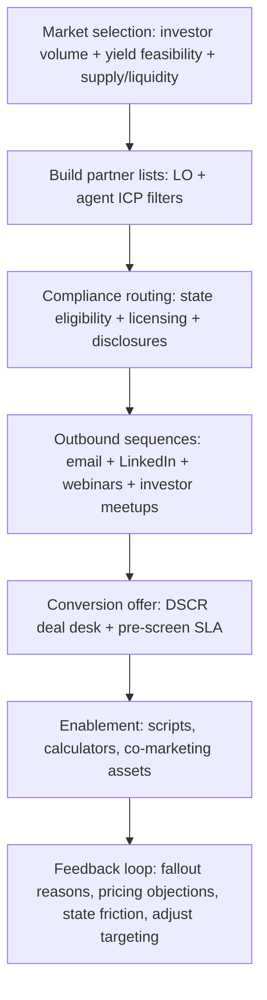

# DSCR Mortgage Programs in the U.S.: Origination Concentration, Emerging Markets, and DSCR Lead-Gen ICPs (2021–2025)

## Executive summary

Debt Service Coverage Ratio (DSCR) mortgage programs are a major segment of the non-QM credit ecosystem used primarily by investment-property borrowers, where underwriting relies heavily on rental cash flow relative to proposed debt service rather than traditional borrower income documentation. citeturn28view0turn11search38 A frequently cited practical driver is that many DSCR loans are structured as business-purpose credit for investment property and therefore sit outside core Ability-to-Repay/Qualified Mortgage (ATR/QM) requirements that apply to consumer-purpose “covered transactions,” though lenders still face meaningful federal, state, and investor/warehouse constraints. citeturn38search8turn38search0turn38search1

On geography, there is no single, free, nationally standardized public dataset that tags “DSCR” at the loan level and can be aggregated cleanly to state + county for the past 3–5 years. Confidence is therefore highest when triangulating multiple “investor-activity” and “rental-yield feasibility” signals sourced from public-records analytics and rental-return benchmarks (detailed in the methodology section), rather than asserting precise DSCR origination counts for every state/county. citeturn35view0turn36view0turn34search8

Using that triangulation, the highest *observed* concentration of investor purchase activity (a strong proxy for DSCR purchase-loan demand) clusters in large coastal and Sun Belt transaction hubs where investor purchase volumes are consistently high and/or growing. Metro-level public-records analysis over major U.S. metros shows investor purchase counts in the low-thousands per quarter in the largest markets, with investor shares commonly in the teens to 20%+ and some markets materially higher. citeturn35view0turn36view0turn34search2

Emerging DSCR opportunity markets (next 12–24 months) increasingly bifurcate into (a) high-volume metros that remain liquid but where pricing and insurance/HOA dynamics shift DSCR viability; and (b) “cash-flow” markets where rental yields make DSCR qualification easier even when price appreciation is moderating. County-level rental-yield benchmarks suggest that many of the highest modeled gross yields sit in specific counties within the Midwest/South and select large-population counties, an indicator of DSCR “math-working” conditions. citeturn34search8turn39search19turn39search12

For lead generation, the most reliable DSCR growth comes from aligning with (1) loan officers already originating investor/non-QM loans and (2) real estate agents deeply embedded in investor acquisition and portfolio-refi workflows. A practical constraint is licensing: one lender’s DSCR state origination guide illustrates that DSCR distribution requirements (broker company licensing, MLO licensing, and additional state-specific requirements) vary widely and must be operationalized in the ICP and routing rules. citeturn40view0

## DSCR program landscape and analytical approach

DSCR mortgage loans are commonly described as non-QM loans used by investment-property investors, where underwriting is “primarily based on the property’s rental income and resulting debt service coverage ratio” rather than borrower wage income. citeturn28view0 In market-facing program descriptions, DSCR products are often framed as “cash flow” rental loans that qualify on the subject property’s rental cash flow and may not require employment or income documentation in the way conventional consumer mortgages do. citeturn11search38turn11search14

A core regulatory nuance for DSCR programs is purpose classification. Regulation Z broadly exempts “business, commercial, agricultural, or organizational credit” from many requirements, and official interpretations discuss how rental-property lending can be deemed business-purpose under certain unit-count and occupancy circumstances. citeturn38search8turn38search1 This matters operationally because DSCR programs are often designed to fit business-purpose investment lending, but purpose classification is fact-specific, and state licensing/real estate and loan-broker rules can still apply (and differ materially). citeturn40view0turn38search8

### Data problem statement

The user’s first question presumes “DSCR mortgage originations” can be ranked at state and county levels. In practice, DSCR is typically a *program/underwriting attribute* that is not reliably labeled in public deed, recorder, or mortgage datasets at national scale. Public datasets that *do* support state/county aggregation (e.g., HMDA) do not provide an explicit “DSCR” flag in public reporting fields, and investor financing can be obscured by cash purchases and purpose classification. citeturn38search13turn35view0turn36view0

### Proxy framework used in this report

To answer the geography and “emerging markets” questions rigorously despite the label gap, the report uses a proxy model with explicit confidence levels:

**Investor purchase volume and share (primary proxy for purchase-loan DSCR demand).** A metro-level public-records analysis covering 38 large metro areas provides investor market share and investor purchase counts for a recent quarter, enabling a ranked market-size view and a concrete base for “where investors transact most.” citeturn35view0 A separate national public-records investor indicator supports a multi-year context (2019–mid-2025) and identifies top investor “cities” (and therefore their associated state/metro ecosystems), including markets absent from some metro datasets due to disclosure limitations. citeturn36view0

**Rental yield feasibility (primary proxy for DSCR qualification ease).** County-level “potential annual gross rental yield” estimates for three-bedroom single-family rentals highlight where rent-to-price ratios are most favorable—a direct DSCR-relevance signal because higher gross yields generally raise DSCR, all else equal. citeturn34search8turn34search0

**House price and supply conditions (context and forward-looking screen).** House price trends and state-level appreciation/declines inform whether DSCR portfolios face growing collateral/exit risk or improving entry yields. citeturn39search19turn39search3turn39search7 Housing supply signals include building permits (pipeline) and active listings (market liquidity and competition). citeturn39search1turn39search17turn39search12

**Demographic demand (context and forward-looking screen).** State population growth, both numeric and percentage, informs rental-demand tailwinds that materially affect rent growth and vacancy risk (and therefore DSCR stability). citeturn39search6turn39search18

**Licensing/regulatory friction (implementation constraint for marketing + distribution).** A DSCR origination state guide illustrates that “where you can originate” and “how you must be licensed” is not uniform, and can reshape target-market prioritization and ICP definitions (routing, compliance, and partner enablement). citeturn40view0

## Where DSCR originations concentrate: state and county/CBSA results

### Top states by DSCR origination concentration

The table below reports an **origination-concentration proxy** (not a definitive DSCR origination census). It combines: (a) investor purchase volumes in large metros where disclosed (recent-quarter metro investor purchases), (b) additional public-records indicators identifying top investor cities (capturing key non-disclosure geographies), and (c) supporting macro tailwinds (population growth). citeturn35view0turn36view0turn39search6

**Interpretation:** states with high investor purchase volume and strong transaction liquidity are likely to generate higher DSCR *purchase* originations (and, secondarily, refi/cash-out pipelines), subject to investor financing preferences (cash vs debt) and lender footprints.

| State | Recent-quarter investor purchases observed in large metros (proxy) | Additional investor-activity evidence (fills disclosure gaps) | Demographic tailwind signal | Confidence |
|---|---:|---|---|---|
| entity["state","California","state, us"] | ~10,040 (sum across multiple large metros in the metro investor dataset) | Identified among top investor cities via a national public-records indicator (major coastal liquidity) | Large, diverse demand base (not a “fastest growth” state, but scale effects) | Medium–High citeturn35view0turn36view0 |
| entity["state","Florida","state, us"] | ~7,795 (sum across multiple large metros in dataset) | Investor share elevated nationally; however, multiple analyses highlight investor pullbacks in parts of the state amid changing economics | High population growth in recent annual estimates | Medium (directionally strong; near-term volatility higher) citeturn35view0turn39search6turn39search19 |
| entity["state","Georgia","state, us"] | ~3,463 (single large metro proxy) | Atlanta identified as a top investor city in national indicator | Strong population growth (2024–2025) | High citeturn35view0turn36view0turn39search6 |
| entity["state","Texas","state, us"] | Not reliably captured in some metro datasets (non-disclosure effects) | Dallas and Houston identified as leading investor cities nationally; implies very high investor transaction volume | Largest numeric population growth (2024–2025) | Medium (high volume likely; exact quantification constrained) citeturn36view0turn39search6 |
| entity["state","Arizona","state, us"] | ~2,564 (single large metro proxy) | Phoenix identified as a top investor city | Positive growth / in-migration era effects | Medium–High citeturn35view0turn36view0 |
| entity["state","New York","state, us"] | ~3,012 (single large metro proxy) | Large-city liquidity supports consistent investor activity | Not a top growth state; demand depends more on local dynamics | Medium citeturn35view0 |
| entity["state","Illinois","state, us"] | ~2,396 (single large metro proxy) | High-yield large-county signal present in rental-yield benchmarking | Not a top growth state; “yield” can be stronger than “growth” | Medium citeturn35view0turn34search8 |
| entity["state","North Carolina","state, us"] | ~1,337 (single large metro proxy) | Strong population growth; inventory growth signals in some metros | Top 3 numeric growth (2024–2025) | Medium–High citeturn35view0turn39search6turn39search8 |
| entity["state","Pennsylvania","state, us"] | ~968 (single large metro proxy) | High-yield large-county signal present (rental-yield benchmarking) | Not a top growth state; can still be DSCR-feasible via yield | Medium citeturn35view0turn34search8 |
| entity["state","Nevada","state, us"] | ~1,451 (single metro proxy) | Investor purchases showing cyclical behavior (sharp YoY downside in some periods) | Often migration-sensitive | Medium citeturn35view0turn39search30 |

### Top 25 CBSA/metro areas by investor purchase volume (proxy for DSCR purchase origination volume)

This table ranks metro areas by **investor purchase count** for one recent quarter in a large-metro public-records analysis (investor share and YoY change included). This is not DSCR-tagged lending, but it is a direct measure of “where investor transactions are happening,” which is the most consistent observable driver for DSCR purchase pipelines. citeturn35view0

| Rank | Metro (CBSA proxy as reported) | Investor purchases | Investor share | YoY change in investor purchases |
|---:|---|---:|---:|---:|
| 1 | entity["city","Atlanta, GA","metro area proxy"] | 3,463 | 18% | 0% |
| 2 | entity["city","Los Angeles, CA","metro area proxy"] | 3,137 | 23% | 9% |
| 3 | entity["city","New York, NY","metro area proxy"] | 3,012 | 21% | 23% |
| 4 | entity["city","Phoenix, AZ","metro area proxy"] | 2,564 | 18% | -6% |
| 5 | entity["city","Chicago, IL","metro area proxy"] | 2,396 | 13% | 10% |
| 6 | entity["city","Tampa, FL","metro area proxy"] | 2,037 | 18% | -5% |
| 7 | entity["city","Miami, FL","metro area proxy"] | 2,006 | 31% | -14% |
| 8 | entity["city","Riverside, CA","metro area proxy"] | 1,649 | 18% | 0% |
| 9 | entity["city","San Diego, CA","metro area proxy"] | 1,558 | 24% | 2% |
| 10 | entity["city","Orlando, FL","metro area proxy"] | 1,528 | 19% | -18% |
| 11 | entity["city","Las Vegas, NV","metro area proxy"] | 1,451 | 21% | -20% |
| 12 | entity["city","Anaheim, CA","metro area proxy"] | 1,426 | 26% | 6% |
| 13 | entity["city","Cleveland, OH","metro area proxy"] | 1,393 | 22% | -1% |
| 14 | entity["city","Charlotte, NC","metro area proxy"] | 1,337 | 16% | -7% |
| 15 | entity["city","Baltimore, MD","metro area proxy"] | 1,292 | 16% | 8% |
| 16 | entity["city","Sacramento, CA","metro area proxy"] | 1,259 | 21% | 0% |
| 17 | entity["city","Washington, DC","metro area proxy"] | 1,252 | 10% | -3% |
| 18 | entity["city","Minneapolis, MN","metro area proxy"] | 1,235 | 10% | 0% |
| 19 | entity["city","Denver, CO","metro area proxy"] | 1,160 | 13% | -9% |
| 20 | entity["city","Fort Lauderdale, FL","metro area proxy"] | 1,126 | 17% | -14% |
| 21 | entity["city","New Brunswick, NJ","metro area proxy"] | 1,113 | 13% | 12% |
| 22 | entity["city","West Palm Beach, FL","metro area proxy"] | 1,098 | 18% | -4% |
| 23 | entity["city","Oakland, CA","metro area proxy"] | 1,011 | 19% | 15% |
| 24 | entity["city","Nashville, TN","metro area proxy"] | 1,009 | 16% | -6% |
| 25 | entity["city","Philadelphia, PA","metro area proxy"] | 968 | 18% | 4% |

Metro dataset coverage note: the underlying analysis is explicitly limited to a subset of large metro areas and is impacted by local disclosure practices and other data limitations; it is not a full nationwide census. citeturn35view0turn36view0

### County concentration “heat map” proxy: where DSCR math is most likely to work

Because DSCR qualification is mechanically sensitive to rent-to-price ratios, a county-level rental-yield ranking is a useful “heat map” proxy for DSCR *feasibility* (even if it is not DSCR origination volume). The county-level gross-yield benchmarks below highlight where modeled annual gross yields for three-bedroom single-family rentals are highest, and separately identify high-yield large-population counties. citeturn34search8turn34search0

| County | State | Potential annual gross yield on 3BR SFRs (ATTOM benchmark) | DSCR relevance |
|---|---|---:|---|
| entity["place","Indian River County, FL","county, us"] | FL | 14.6% | Very high DSCR-feasibility signal |
| entity["place","St. Louis City, MO","independent city, us"] | MO | 14.6% | Very high DSCR-feasibility signal |
| entity["place","Cameron County, TX","county, us"] | TX | 13.2% | Very high DSCR-feasibility signal |
| entity["place","Monroe County, NY","county, us"] | NY | 12.8% | Very high DSCR-feasibility signal |
| entity["place","Richmond County, GA","county, us"] | GA | 12.7% | Very high DSCR-feasibility signal |
| entity["place","Wayne County, MI","county, us"] | MI | 12.0% | High-yield large-county signal |
| entity["place","Allegheny County, PA","county, us"] | PA | 11.2% | High-yield large-county signal |
| entity["place","Cuyahoga County, OH","county, us"] | OH | 10.2% | High-yield large-county signal |
| entity["place","Cook County, IL","county, us"] | IL | 10.1% | High-yield large-county signal |
| entity["place","Riverside County, CA","county, us"] | CA | 9.7% | High-yield large-county signal |

## Markets emerging as DSCR candidates: screening results and implications

This section answers the second question by identifying **markets that look structurally attractive for DSCR program growth** given (a) demographic demand tailwinds, (b) observable investor transaction activity, (c) yield feasibility, (d) supply/liquidity conditions, (e) price-trend regime shift, and (f) implementation friction (licensing and rule complexity).

### Macro signals shaping DSCR market selection

Population growth in recent annual estimates is concentrated in a small set of states, with the top numeric growth led by the largest Sun Belt states and additional growth in a Southeast corridor. citeturn39search6 This matters for DSCR because migration-supported household formation supports rental demand depth and can stabilize occupancy and rent collections, which influences DSCR stability and refinance viability.

Housing supply signals are mixed: building permits authorize large volumes nationally but fluctuate with rates and construction economics. The Building Permits Survey explicitly provides state and local authorization counts and serves as a forward-looking pipeline indicator. citeturn39search17turn39search1 Separately, active listing counts have been rising year-over-year through 2025 into early 2026, though still below pre-pandemic norms, and metro-level inventory growth is uneven (which can shift investor negotiation leverage and entry cap rates). citeturn39search4turn39search12turn39search8

Price-trend regime is also meaningfully different than 2021–2022: a recent federal house price index release indicates modest national year-over-year appreciation with declines in a subset of states and specific downside in some high-volatility markets. citeturn39search19turn39search7 For DSCR programs, this shifts the “refi set” (fewer high-rate refis) and increases the importance of initial yield quality and insurance/expense underwriting.

Finally, multi-year investor purchase trends show a pandemic-era peak and a post-peak normalization: investor purchases were far higher in mid-2021 than mid-2024 in one CoreLogic-reported framing, while a national public-records indicator suggests 2022 average monthly investor purchases were materially above 2024–2025 levels. citeturn34search11turn36view0 This informs DSCR program planning because DSCR origination is pro-cyclical with investor acquisition volume and refinance incentives.

### Emerging market shortlist

The markets below are selected to complement (not duplicate) the top-25 metro “volume” set, emphasizing either (a) large, high-volume investor ecosystems that may be missing from some metro datasets due to disclosure limitations, or (b) markets where yield feasibility and/or inventory dynamics suggest improving DSCR scalability.

**entity["place","Dallas–Fort Worth, TX","cbsa area, us"]**  
A national public-records investor indicator identifies Dallas as a top investor city and notes continued leadership in investor and non-investor purchases, strongly implying sustained investor transaction volume and therefore DSCR pipeline opportunity (purchase + refi). citeturn36view0turn39search6 A key analytic caution is that some metro datasets under-cover TX due to non-disclosure practices, so market sizing should rely on direct lender data, title/closing streams, or paid public-records feeds for precise DSCR attribution. citeturn35view0turn36view0

**entity["place","Houston, TX","city metro proxy, us"]**  
The same national investor indicator places Houston among top investor cities, consistent with a “high-volume, high-liquidity” DSCR footprint. citeturn36view0 Demographic momentum at the state level strengthens long-run rental depth assumptions relative to slower-growth regions, supporting DSCR stability. citeturn39search6

**entity["city","Seattle, WA","metro area proxy"]**  
West Coast investor activity is reported as accelerating in this market (large YoY change), and broader inventory-growth commentary also flags significant listing growth in late 2025, which can support investor entry opportunities (more selection, fewer bidding wars). citeturn35view0turn39search8turn39search12 This combination suggests a DSCR “re-acceleration” candidate where investor confidence may be rebounding even as rates remain elevated.

**entity["city","San Francisco, CA","metro area proxy"]**  
Investor purchases show a strong YoY increase in one large-metro dataset, consistent with a coastal investor re-entry narrative. citeturn35view0 For DSCR programs, the key underwriting sensitivity here is expense load (taxes, insurance, HOA) versus rent growth, implying that programs emphasizing accurate rent schedules and conservative expense assumptions should outperform.

**entity["city","Milwaukee, WI","metro area proxy"]**  
This market shows a high YoY investor purchase increase in the same dataset, which can signal an emerging investor “rotation” to more affordable metros as high-cost markets compress yields. citeturn35view0turn39search16 DSCR relevance is highest when the investor base is dominated by small and medium landlords who need financing scale rather than institutional cash-only strategies. citeturn36view0

**entity["city","Portland, OR","metro area proxy"]**  
This market also shows a high YoY increase in investor purchases, again consistent with West Coast rotation dynamics. citeturn35view0 DSCR programs in this type of market are best positioned when paired with strong compliance/operations given local policy volatility risks (the investor analysis explicitly notes that tightened regulations can cool parts of the rental/STR market). citeturn35view0

**entity["city","Columbus, OH","metro area proxy"]**  
While not a top-25 volume market in the referenced quarter, investor purchases are meaningful and relatively stable, and nearby large-county yield signals in the region support DSCR math feasibility. citeturn35view0turn34search8 This is representative of Midwest “cash-flow” metros where DSCR programs can scale by targeting small landlords.

**entity["city","St. Louis, MO","metro area proxy"]**  
The county-level gross rental yield benchmark identifies extremely high modeled yield in the core independent-city area, implying favorable rent-to-price ratios that can materially improve DSCR outcomes. citeturn34search8 For DSCR marketing, these markets may be “smaller ticket, higher velocity” with greater emphasis on simple processes and fast closings versus jumbo sizing.

### Operational constraint: licensing and state-by-state friction

A DSCR origination state guide published by a lender illustrates that DSCR origination is not “nationwide by default.” It explicitly shows varying requirements for broker company licensing and MLO licensing across states, plus “additional requirements” in certain states (e.g., loan broker registration or real estate license requirements). citeturn40view0

For market-entry planning, this implies DSCR lead-gen programs should maintain (a) state eligibility flags, (b) license/registration logic for both the originating entity and the individual originator, and (c) rules that prevent marketing into restricted states when fulfillment capacity isn’t compliant.

## Lead-generation ICPs for DSCR: loan officers and real estate agents

This section defines **ideal ICPs** for a DSCR lead-gen program and ties each attribute to how DSCR programs actually work and where investor demand is strongest.

Two investor-structure facts drive the ICP design:

1) Investor purchases remain a large share of transactions in many markets but fluctuate with rates and price conditions; investors regularly represent high-teen shares in large metro datasets. citeturn35view0turn34search2  
2) Small and medium investors (by owned-property count) represent the majority of investor market share in a national public-records indicator, with medium investors increasing share (June 2024 to June 2025) while small investors remain the largest segment—suggesting DSCR demand is not purely institutional. citeturn36view0

### ICP table: recommended attributes and outreach tactics

The table below is designed for direct operational use (list building, segmentation, channel mix, messaging, and compliance routing). Where facts depend on state law/licensing, the table references variable state requirements rather than asserting uniform rules. citeturn40view0

| ICP dimension | Ideal loan officer profile (DSCR) | Ideal real estate agent profile (DSCR) | Recommended outreach tactics | Core pain points to address | High-performing messaging angle |
|---|---|---|---|---|---|
| Firm size & structure | Small-to-mid independent mortgage broker shop, non-QM specialist IMB, or “investor desk” inside a multi-branch brokerage (enough volume to justify process, small enough to adopt new programs quickly) | Mid-to-high producing agent or small team; works repeat investor acquisitions and has referral loops with property managers/contractors | Build segmented lists by investor-heavy metros (Table: Top 25 metros) and by yield counties (county yield table); then deploy sequence-based outreach across email + LinkedIn + webinar invites | “I lose investor deals because financing is slow or unclear”; “investors can’t document income like W-2 borrowers”; “agent has no reliable DSCR lender partner” | “Underwrite the property—not the borrower’s W-2” (aligned to DSCR definition); “Close faster with a repeatable investor workflow” citeturn28view0turn11search38 |
| Licensing & compliance posture | Fully NMLS-enabled operation; has capacity to originate where state rules permit and to route/disclose appropriately; willingness to follow state-by-state constraints | Not licensing-driven, but needs clear compliance-safe communication (no rate quotes without lender context) | Introduce a “state eligibility + licensing checklist” early in onboarding; embed compliance routing in lead distribution | “Can we even do DSCR in this state?”; “What licenses are required?”; “I don’t want compliance problems from marketing claims” | “We’ll pre-clear eligibility and licensing per state before you pitch investors,” grounded in state-guide variability citeturn40view0 |
| Production volume | Consistent monthly origination (enough to value new program); prior investor or non-QM experience | Consistent monthly transactions; investor share of client base meaningful (repeat buyers) | Use “value-first” hook: investor scenario calculators, rent schedules, DSCR pre-screen checklists; co-host local investor webinars | “My investors need certainty: will rent qualify?”; “I need fast pre-approvals to win bids” | “Fast DSCR pre-screen from a rent schedule + purchase price; reduce fallout” (position to reduce wasted offers) citeturn11search38 |
| Geographic focus | Concentrated in high investor transaction metros and/or high-yield counties; can expand as licensing permits | Works submarkets with heavy investor turnover (starter-home price bands, build-to-rent edges, suburban rental corridors) | Prioritize (1) high-volume metros, (2) “emerging” metros with strong YoY investor growth, (3) high-yield counties where DSCR is easier | “My market is shifting; what worked in 2021 doesn’t work now” | “Shift from appreciation-first to cash-flow-first underwriting and deal selection,” consistent with post-peak dynamics citeturn34search11turn36view0turn39search19 |
| Investor client mix | Serves small landlords (<10 properties) and scaling landlords (10–99 properties); can handle LLC/title/insurance issues | Has investor clients who buy multiple properties per year; understands BRRRR, long-term holds, and cash-out cycles | Partner marketplaces: investor meetups, property management firms, “landlord communities”; run co-branded education | “Investors want leverage but hate paperwork”; “cash buyers still use leverage elsewhere” | “DSCR is designed for the scaling landlord,” aligned to investor-size composition and the prevalence of small/medium investors citeturn36view0turn35view0 |
| Marketing channels | Responsive to referral partnerships + education; already uses CRM/email; active on LinkedIn and local investor groups | Uses social + referrals; invests in lead sources; values lender partners who feed deals | Offer co-marketing: templates, landing pages, pre-screen forms; run “deal desk” office hours weekly | “I can’t differentiate; every lender pitches ‘fast’”; “agents need financing certainty to make offers” | “A repeatable investor financing flywheel: pre-screen → offer → close → repeat,” emphasizing operational system |
| Program fit & product narrative | Needs program clarity: DSCR thresholds, LTV, property types, rent calculation, reserves | Needs simple explanation to investors without over-promising | Provide one-page “DSCR program guardrails” + example deals (purchase + refi) | “Guidelines change; unclear overlays”; “investor fears of appraisal/rent underwrite mismatch” | “Transparent DSCR guardrails + fast scenario answers,” anchored to DSCR product positioning citeturn11search38turn11search14 |

### DSCR lead-gen funnel flowchart



## Data gaps and confidence levels

**Direct DSCR origination volume by county/state (gap: high).** “DSCR” is not consistently labeled in free public loan-level data suitable for nationwide county aggregation. As a result, rankings in this report use investor purchase volumes and rental-yield feasibility as transparent proxies rather than claiming a definitive DSCR origination census. citeturn35view0turn36view0turn34search8

**Non-disclosure states and metro coverage (gap: material).** Some metro-level investor purchase datasets explicitly exclude certain metros due to non-disclosure of sale prices and other data constraints, which likely under-represents investor activity (and therefore DSCR demand) in key non-disclosure states. citeturn35view0turn36view0

**County “heat map” is feasibility-oriented, not volume-oriented (confidence: medium).** County rental yield benchmarks are directly relevant to DSCR qualification math, but they are not a measure of DSCR originations; they are best interpreted as “where DSCR is easiest to underwrite” and “where investor cash-flow strategies may concentrate.” citeturn34search8turn34search0

**Forward-looking market calls (confidence: medium).** Emerging-market recommendations are inference-based, grounded in (a) investor purchase trends and market-share shifts, (b) population growth signals, (c) inventory/supply dynamics, and (d) house price trend regime changes. citeturn39search6turn39search12turn39search19turn35view0

**Compliance/licensing variability (confidence: high as “constraint exists,” medium as “state-by-state details”).** The existence of substantial state variation is strongly supported by the DSCR state guide example; however, this is one lender’s guide and should be validated against your specific lender channel and counsel. citeturn40view0

## Source URLs

```text
https://www.redfin.com/news/investor-home-purchases-q3-2025/
https://www.redfin.com/blog/housing-market-year-in-review-2025/
https://www.cotality.com/press-releases/investors-buy-nearly-one-third-of-homes-across-us
https://www.attomdata.com/news/most-recent/attoms-q1-2024-single-family-rental-market-report/
https://www.attomdata.com/hnr/q1-2024-single-family-rental-market-report/
https://wholesale.springeq.com/hubfs/Wholesale%20File%20Transfer/2022_website_rates_fees_guidelines_matrices/Active%20DSCR%20State%20Licensing%20Map.pdf
https://www.consumerfinance.gov/rules-policy/regulations/1026/3
https://www.ecfr.gov/current/title-12/chapter-X/part-1026/subpart-A/section-1026.3
https://www.consumerfinance.gov/rules-policy/regulations/1026/43
https://www.fhfa.gov/data/hpi/datasets
https://www.fhfa.gov/data/hpi
https://www.fhfa.gov/news/news-release/u.s.-house-prices-rise-1.8-percent-year-over-year-up-0.8-percent-quarter-over-quarter
https://www.census.gov/data/tables/time-series/demo/popest/2020s-state-total.html
https://www.census.gov/newsroom/press-releases/2026/population-growth-slows.html
https://www.census.gov/construction/bps/pdf/2024annualhighlights.pdf
https://www.census.gov/permits
https://www.realtor.com/research/december-2025-data/
https://mediaroom.realtor.com/2026-01-08-Realtor-com-R-Monthly-Housing-Report-Inventory-Keeps-Growing%2C-but-2025-Revealed-a-Market-of-Exceptions%2C-Not-Averages
https://www.realtor.com/news/real-estate-summary/home-inventory-rising-top-metros/
https://www.sec.gov/Archives/edgar/data/2066337/000199937125007032/cnlrcred-1012g_060225.htm
```